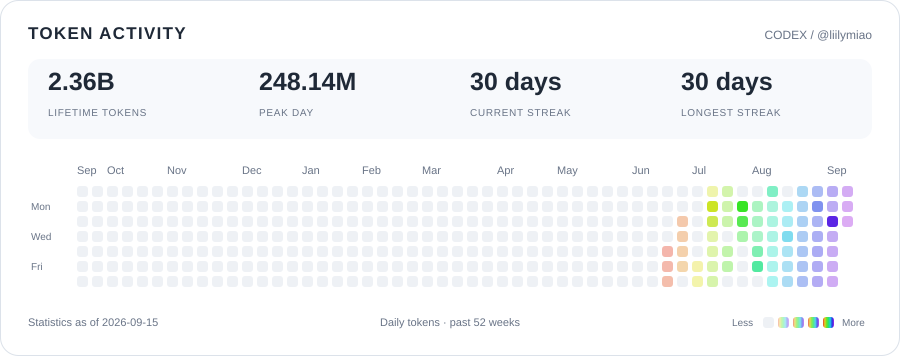

## Token activity

<picture>
  <source media="(prefers-color-scheme: dark)" srcset="assets/token-activity-dark.svg">
  <source media="(prefers-color-scheme: light)" srcset="assets/token-activity.svg">
  
</picture>

Daily token activity from my Codex profile. The card shows the source's statistics date; it is a snapshot, not a live counter.

About this activity graph

The heatmap uses Codex's daily token totals and four intensity levels relative to the busiest day in the displayed period. Each square represents one day. Dates and streaks follow the source statistics.

Only aggregate token counts and streaks are published. Conversations, prompts, task names, file paths, and credentials stay off this repository. These are token counts, not spending or remaining subscription quota.

[Aggregate data](data/token-activity.json) · [Update instructions](docs/updating.md)

